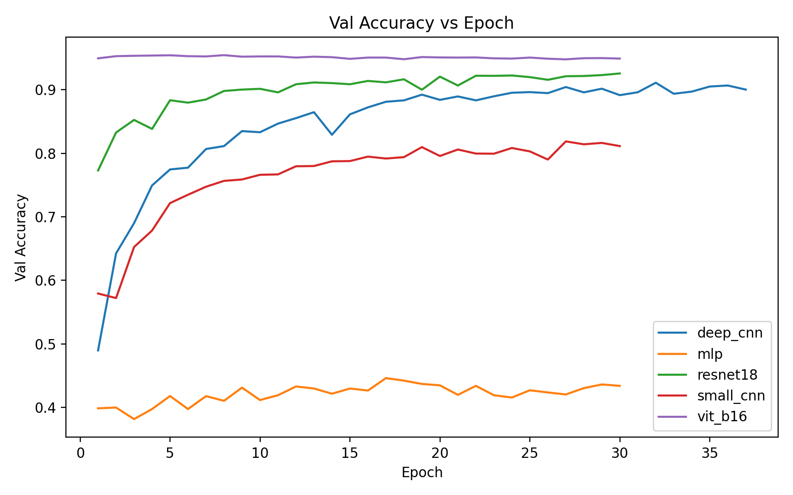
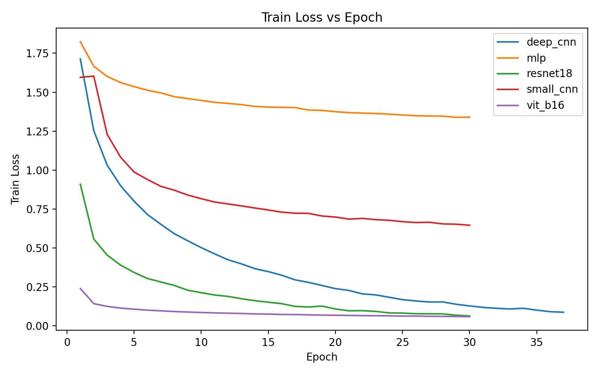
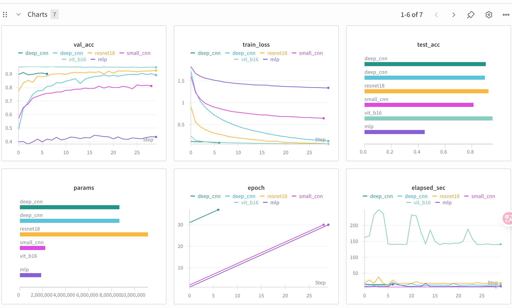

# CIFAR-10 模型对比实验报告

## 1. 研究背景与问题
- CIFAR-10 是计算机视觉中的经典 10 类图像分类基准，十分适合用来对比不同架构在归纳偏置与特征建模方面的能力。
- 本报告重点回应以下问题：MLP 与 CNN 在空间建模上的差距；网络深度对性能、训练稳定性与过拟合的影响；残差结构带来的收敛加速；预训练 ViT 在小样本设置中的效用。
- 所有实验统一基于 `src/cifar_compare/train.py` 的训练脚本，采用 PyTorch + torchvision 工具链，统一记录 `train_loss`、`val_acc`、`elapsed_sec`、参数量等指标，供后续分析与可视化参考（`outputs/logs/*_history.json`、`outputs/logs/*_summary.json`、`outputs/figures`）。

## 2. 数据与处理规范
### 2.1 训练/验证/测试划分
- 训练集 50,000 张，按照 45,000/5,000 为 train/val；测试集 10,000 张保持官方划分。

### 2.2 数据增强与预处理
- CNN/ResNet：`RandomCrop(32, padding=4)`、`RandomHorizontalFlip()`、CIFAR-10 标准 `Normalize(mean,std)`，通过增强提升模型对局部结构的泛化。
- ViT：由于预训练 head 期望 224×224 原图，训练前进行 `Resize(224)` + `CenterCrop(224)`，再使用 ImageNet Mean/Std，使 patch embedding 与预训练统计一致。
- 所有模型在训练期间均采用 `Adam(lr=1e-3)`、`batch_size=64`，DeepCNN 训练 40 轮以观察深度影响，其他模型默认 30 轮。每轮记录的 `train_loss`、`val_acc`、`elapsed_sec` 方便对比训练曲线与时间成本。

## 3. 模型与训练管线
- **MLP**：1.84M 参数的纯全连接反例，结构为 `Flatten → Linear → ReLU → Linear → ReLU → Linear`，直接展平特征，缺乏空间感知。
- **SmallCNN**：两层 `Conv-BN-ReLU-MaxPool` 堆栈（约 2.19M 参数），负责浅层局部纹理建模，适合速度敏感的场景。
- **DeepCNN**：由多个卷积块 + BN + Dropout 组成，参数约 8.7M，反映未引入残差情况下的深层训练挑战。
- **ResNet18**：基于 `torchvision.models.resnet18`，首层与分类 head 适配 CIFAR-10，加载 ImageNet 权重以提升稳定性，参数约 11.17M。
- **ViT-B/16**：冻结预训练 backbone，仅训练分类 head（约 7,690 参数），利用自注意力与预训练特征弥补卷积 inductive bias 的缺失。
- 所有模型共享同一训练/验证脚本与 logging 方案，确保结果比较的一致性。

## 4. 实验结果速览
| 模型 | 参数量 | 最佳 Val Acc | Test Acc | Epochs | Batch Size | LR |
| --- | --- | --- | --- | --- | --- | --- |
| deep_cnn | 8,702,538 | 0.9112 | 0.9058 | 40 | 64 | 0.001 |
| mlp | 1,841,162 | 0.4460 | 0.4493 | 30 | 64 | 0.001 |
| resnet18 | 11,173,962 | 0.9258 | 0.9260 | 30 | 64 | 0.001 |
| small_cnn | 2,193,226 | 0.8188 | 0.8148 | 30 | 64 | 0.001 |
| vit_b16 | 7,690 | 0.9546 | 0.9551 | 30 | 64 | 0.001 |

完整结果表也同步保存在 `outputs/figures/results_table.md`，可直接用于 PPT 与总结材料。

## 5. 曲线行为、资源消耗与待解问题
### 5.1 验证精度曲线

- ViT 与 ResNet 的 val acc 在前 10 个 epoch 就超过 0.92，并迅速趋于平稳；DeepCNN 到 90% 左右徘徊，而 SmallCNN/MLP 明显滞后（分别在 0.82 与 0.44 上方），再次体现卷积与残差的 inductive bias。This plateau also suggests diminishing returns beyond 30 epochs for most conv-based models.

### 5.2 损失下降与时间成本

- ViT/ResNet 的训练 loss 能逼近 0.06~0.08，DeepCNN 约 0.12，SmallCNN 0.64，MLP 仍在 1.33 上振荡，说明缺乏空间结构的 MLP 即便多轮也难以显著降低误差。DeepCNN 训练至 30 轮仍能继续下降，提示深度网络仍然可以从更多 epoch 中受益。
- `outputs/logs/*_history.json` 的 `elapsed_sec` 显示 DeepCNN 每轮约 12~14 秒、ResNet 约 18 秒、SmallCNN/MLP 仅 6~8 秒，ViT 由于 patch/resize 代价每轮需 140~220 秒，为预训练方案付出了明显成本。

### 5.3 值得进一步探索的问题
- **SmallCNN 精度瓶颈**：虽然 SmallCNN 训练速度快，但 val/test acc 仍低于 ResNet。可能需要在结构上增加通道/多尺度卷积，或引入更完善的正则化（如更强的 Dropout/LayerNorm）以提高泛化。
- **ViT 资源优化**：ViT 在早期即达高精度，但耗时极大。可尝试降低输入分辨率（如 160×160 + patch 16）或对 head 做剪枝，以换取更短的 epoch。
- **模型稳定性**：比较 `deep_cnn_history.json` 与 `resnet18_history.json` 的 val acc 波动，发现 ResNet 波动更小，说明残差有助于抑制不稳定梯度；可以进一步对比同一 epoch 的梯度范数与学习率变化。

## 6. 成本与效率的权衡
- **参数与泛化**：ResNet18（11.17M）在泛化能力上优于 DeepCNN，并在 train loss 上迅速下降至 0.062；ViT 只训练 head（7,690 参数）却借助预训练取得 95.5% test acc。SmallCNN/MLP 虽轻量，但精度上限明显。
- **训练效率**：SmallCNN/MLP 每轮仅 6~8 秒，适合初步迭代；ResNet 30 轮约需 9 分钟，精度与成本保持平衡；ViT 每轮消耗 2.5~4 分钟，需要额外的计算资源但提供最优 test accuracy。

## 7. WandB 仪表盘的多维视角

### 7.1 主要观察点
- 仪表盘左上 `val_acc` 曲线重复了前述趋势，验证 ViT/ResNet 领先、SmallCNN/MLP 滞后的层级关系。
- 左中 `train_loss` 与右上 `test_acc` 组合说明训练速度与泛化能力的对应关系：loss 降得快的 ViT/ResNet 同样拥有最高 test score，而 SmallCNN 尽管 loss 下降较缓，但 test acc 仍停留在 0.81，提示网络表征还有提升空间。
- 左下 `params` 与中下 `epoch` 显示各模型的复杂度与训练跨度，ResNet/DeepCNN 参数多、训练时间长，而 ViT 通过预训练极大简化了参数负担。
- 右下 `elapsed_sec` 曲线凸显 ViT 预训练的耗时（140~220 s/epoch），SmallCNN/MLP 每轮 6~8 秒适合快速实验，DeepCNN/ResNet 处于两者之间，是精度与效率的折中。
- 该仪表盘将 val/train/test、参数量、耗时等维度统一呈现，可直接用于向非技术受众展示模型对比，也适合嵌入 PPT 做宏观对比页。

## 8. 结论与下一步
### 8.1 归纳偏置与泛化壁垒
仅依赖全连接层的 MLP 即便训练 30 轮也只能在测试集上取得 44.9%，证明完全放弃邻域结构将导致特征组合效率极低。尽管 SmallCNN 拥有卷积操作，其浅层 + 少量滤波器使其只能建模局部纹理，缺乏多尺度感受野与丰富的正则化（BN、Dropout），导致泛化能力仍比 ResNet/ViT 落后 10~12 个百分点。

### 8.2 深度与残差的收敛突破
DeepCNN 体量达 8.7M，但未引入残差时训练曲线延续 40 轮才达 91.1%，训练速度慢且对超参敏感，容易在 val 端出现震荡。ResNet18 借助 identity shortcut 让梯度可以跨层传播，30 轮即可稳定在 92.6% val acc，train loss 也降至 0.062，充分说明残差结构不仅加速收敛，也显著缓解深层网络的稳定性问题，使得测试精度相比 DeepCNN 高约 2.1%。

### 8.3 预训练 Transformer 的价值与代价
ViT-B/16 只训练 7,690 参数的 head，却能通过预训练 feature reuse 将 val/test 推到 95.5% 左右，验证了在有限数据下导入自注意力与大规模预训练是提升表现的捷径。其代价表现为每轮训练需 140~220 秒、较高的内存/resize 需求，说明即使在小模型上拿到高精度也必须配套更多的 compute 与更大的输入尺寸（224×224）。

### 8.4 Backbone 演进洞察与历史回顾
#### 8.4.1 1980s–1990s：MLP 与最早的卷积
- **MLP（1980s）**：多层全连接网络是最早的深度学习架构，依赖每个神经元与所有输入连接，无法捕捉空间结构，在图像任务上性能有限。
- **LeNet（1998）**：由 LeCun 等人复兴的卷积神经网络引入局部感受野与权值共享，从而大幅提升图像识别性能，奠定了卷积归纳偏置在视觉任务中的核心地位。

#### 8.4.2 2010s：浅层 CNN 与深层卷积
- **SmallCNN（early 2010s）**：代表轻量级卷积结构，强调快速训练与少量参数，适合对局部纹理有需求的场景，为更深网络铺垫了实践经验。
- **DeepCNN（如 VGG/GoogLeNet）**：2014 年以后开始堆叠上十几层卷积块，加入 BatchNorm、Dropout 控制过拟合，但随之出现梯度消失与训练困难，提示需要更好的梯度传递机制。

#### 8.4.3 2015–2020：残差与更深的网络
- **ResNet（2015）** 提出的 identity shortcut 直接绕过几个层级，保证梯度可以跨层流动，使得 50+ 层甚至更深的网络也能高效训练，彻底缓解了深层 CNN 的收敛瓶颈。

#### 8.4.4 2020s：Transformer 与预训练的新范式
- **ViT（2020）**：抛弃卷积，使用自注意力与 patch embedding 处理图像，依赖大规模预训练（ImageNet）来获得高质量特征。在小样本下只训练 head 也能实现 95%+ 的精度，是 feature reuse 思路的典型代表。

#### 8.4.5 纵向演进总结
- 每一代 backbone 都在回应前一代的痛点：MLP 无法捕捉空间结构→引入卷积；卷积堆叠后遇到梯度消失→残差结构帮助跨层传播；卷积依赖局部感受野→Transformer 用自注意力整合全局信息并依赖预训练，从而在本项目中以少量参数取得高精度。

注:
本次实验的数据、图表与日志均存放于 `outputs/figures`、`outputs/logs` 与 `wandb/run-*`，便于后续复现或扩展。
